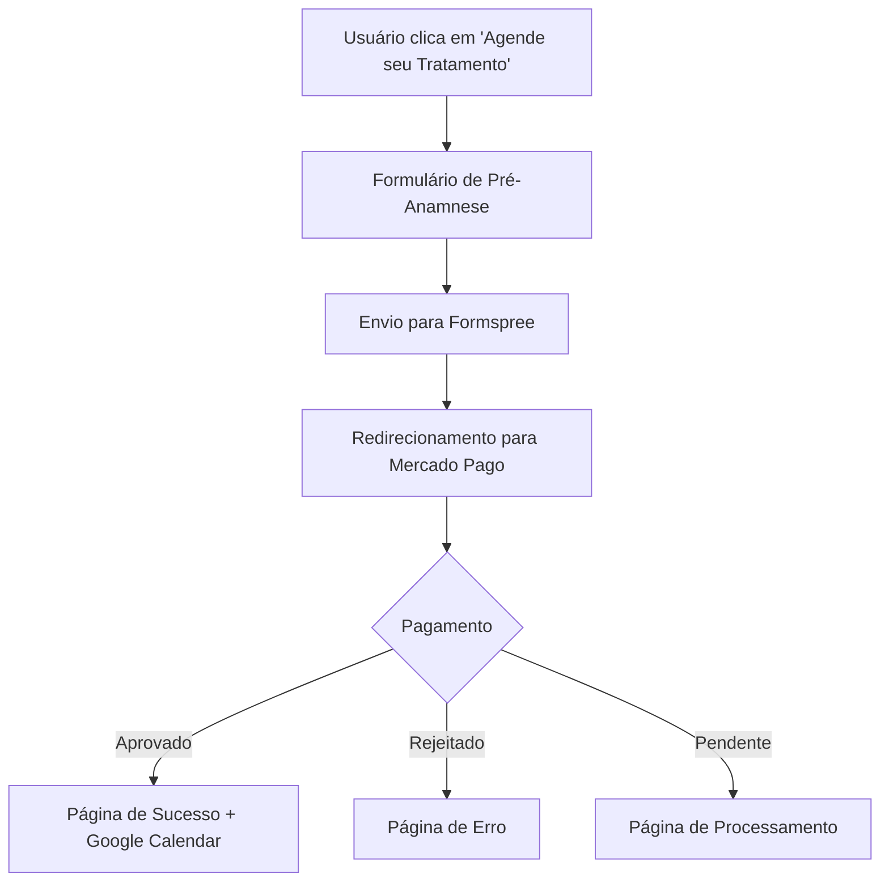

# 🚀 Sistema de Pagamentos Holozonic - Guia de Configuração (Vercel Functions)

## 📋 Visão Geral

Sistema completo de agendamento e pagamentos integrado com **Vercel Functions**:
- **Frontend + Backend** na mesma URL (Vercel)
- **Formulário de Pré-Anamnese** (Formspree)
- **Sistema de Pagamentos** (Mercado Pago via Vercel Functions)
- **Agendamento** (Google Calendar)

## 🛠️ Pré-requisitos

### Node.js e NPM
```bash
# Verificar se Node.js está instalado
node --version
npm --version

# Se não estiver instalado, baixe em: https://nodejs.org/
```

### Dependências do Projeto
```bash
# Instalar dependências do backend
npm install
```

## ⚙️ Configuração

### 1. Variáveis de Ambiente

Crie um arquivo `.env` na raiz do projeto:

```env
# Configurações do Mercado Pago
MERCADOPAGO_ACCESS_TOKEN=APP_USR-5956351957753101-061711-e7363d09d29a257c3e1d645ba3004ae8-1862853195
MERCADOPAGO_PUBLIC_KEY=APP_USR-101288b1-79a0-477a-b6ef-ae973433bc65

# Configurações do Servidor
PORT=3000
NODE_ENV=development

# URLs de retorno (ajustar para produção)
SUCCESS_URL=http://localhost:3000/sucesso.html
FAILURE_URL=http://localhost:3000/erro.html
PENDING_URL=http://localhost:3000/pendente.html
```

### 2. Configuração do Formspree

O formulário já está configurado com ID: `xrbgoqod`
- Se precisar alterar, modifique em `formulario-preanamnese.html` linha 72

### 3. Configuração do Google Calendar

O calendário já está configurado para: `holozonic@gmail.com`
- Para alterar, modifique em `sucesso.html` linha 247

## 🚀 Executando o Sistema

### 1. Instalar Vercel CLI (primeira vez)

```bash
npm install -g vercel
```

### 2. Iniciar desenvolvimento local

```bash
# Desenvolvimento com Vercel Functions
npm run dev
```

O sistema estará disponível em: `http://localhost:3000`

### 2. Verificar Status

Acesse `http://localhost:3000` para ver se está funcionando.

### 3. Testar Funcionalidades

1. **Página Principal**: Clique em qualquer botão "Agende seu Tratamento"
2. **Formulário**: Preencha o formulário de pré-anamnese
3. **Pagamento**: Será redirecionado para o Mercado Pago
4. **Sucesso**: Após pagamento, verá o Google Calendar

## 📁 Estrutura de Arquivos

```
holozonicsubpages/
├── package.json                       # Dependências
├── vercel.json                        # Configuração Vercel
├── api/                               # ⭐ Vercel Functions
│   ├── criar-pagamento.js             # Function: Criar pagamentos
│   ├── webhook.js                     # Function: Webhook Mercado Pago
│   └── servicos.js                    # Function: Listar serviços
├── formulario-preanamnese.html         # Formulário de pré-anamnese
├── sucesso.html                       # Página de sucesso + calendário
├── erro.html                          # Página de erro
├── pendente.html                      # Página de pagamento pendente
├── js/
│   ├── agendamento.js                 # Sistema de pagamentos
│   ├── main.js                        # Scripts principais
│   └── analytics.js                   # Analytics
├── styles/
│   ├── main.css                       # Estilos principais
│   └── header.css                     # Estilos do header
└── img/                               # Imagens e vídeos
```

## 🔧 Valores dos Serviços

### Pacotes (8 sessões)
- **Laser Acupuntura**: R$ 576 (R$ 72/sessão)
- **Moxabustão**: R$ 720 (R$ 90/sessão)
- **Ventosaterapia**: R$ 800 (R$ 100/sessão)
- **Ozonioterapia**: R$ 960 (R$ 120/sessão)
- **Dietoterapia Chinesa**: R$ 720 (R$ 90/sessão)
- **Fitoterapia & Suplementação**: R$ 880 (R$ 110/sessão)

### Consultas
- **Consulta Clínica**: R$ 390

### Tratamentos Individuais
- **Laser Acupuntura**: R$ 125
- **Moxabustão**: R$ 90
- **Ventosaterapia**: R$ 125
- **Dietoterapia Chinesa**: R$ 120
- **Fitoterapia & Suplementação**: R$ 180
- **Ozonioterapia**: R$ 150
- **Feridas (Presencial)**: R$ 150
- **Feridas (Domicílio)**: R$ 200

### Exames
- **Exame do Sono**: R$ 350
- **Biorressonância**: R$ 300
- **Oxigenio-ozonioterapia Estética**: R$ 200

## 🔄 Fluxo Completo



## 🌐 Produção

### Deploy do Backend

1. **Vercel/Netlify**: Para deploy automático
2. **Heroku**: Para aplicações Node.js
3. **VPS**: Para controle total

### Configurações de Produção

```env
NODE_ENV=production
SUCCESS_URL=https://seudominio.com/sucesso.html
FAILURE_URL=https://seudominio.com/erro.html
PENDING_URL=https://seudominio.com/pendente.html
```

### Atualizar URLs no Frontend

Edite `js/agendamento.js` linha 32:
```javascript
this.serverURL = 'https://sua-api-url.com'; // URL do seu servidor
```

## 🐛 Troubleshooting

### Erro "Cannot POST /criar-pagamento"
- Verifique se o servidor Node.js está rodando
- Confirme a URL no arquivo `js/agendamento.js`

### Formulário não redireciona
- Verifique o ID do Formspree
- Confirme se os parâmetros da URL estão corretos

### Pagamento não processa
- Verifique as credenciais do Mercado Pago
- Confirme se as URLs de retorno estão acessíveis

### Calendar não aparece
- Verifique se o Gmail está configurado para calendário público
- Confirme a URL do iframe no `sucesso.html`

## 📞 Contatos

**E-mail**: contato@holozonic.com.br  
**WhatsApp**: (11) 99999-8888  
**Telefone**: (11) 3333-4444

## 📝 Logs

Os logs do servidor aparecem no console. Para debugar:

```bash
# Ver logs em tempo real
npm run dev

# Logs importantes:
# ✅ Botão configurado
# 📝 Criando pagamento para: {serviço}
# 🔔 Webhook recebido
# ❌ Erro ao criar preferência
```

---

**🏥 Holozonic - Integrando tradição e inovação para seu bem-estar** 